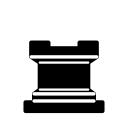

## Attack/defence values

For a capture to be valid, the attacking piece's attack value must be greater than the defending piece's defence value.

Hierarchy of values: None < Basic < Powerful

## Pawn

Configuration parameter: max number of squares moved on first move (default 2).

If moving n spaces where n > 2, can be en passant captured as if it had moved anywhere from 1 to n-1 squares.

Otherwise, moves the same as standard chess.

Attack: Basic \
Defence: None

## Knight

Moves the same as standard chess.

Attack: Basic \
Defence: None

## Bishop

Moves the same as standard chess.

Attack: Basic \
Defence: None

## Rook

Moves the same as standard chess.

Attack: Basic \
Defence: None

## Queen

Moves the same as standard chess.

Attack: Basic \
Defence: None

## King

Moves the same as standard chess.

Attack: Powerful

Can be checked by any piece with at least a Basic attack.

## Archbishop

Moves as the combination of a Bishop and a Knight.

Attack: Basic \
Defence: None

## Chancellor

Moves as the combination of a Rook and a Knight.

Attack: Basic \
Defence: None

## Camel

Jumps 3 spaces in 1 direction and 1 space perpendicular to that.

Attack: Basic \
Defence: None

## Zebra

Jumps 3 spaces in 1 direction and 2 spaces perpendicular to that.

Attack: Basic \
Defence: None

## Mann

Moves like a Queen, but only 1 space at a time.

Attack: Basic \
Defence: None

## Nightrider

Moves like a Knight, but can move multiple times in the same direction in a single move.

Attack: Basic \
Defence: None

## Champion

Moves like a Queen up to 2 spaces at a time, can jump.

Attack: Basic \
Defence: None

## Centaur

Moves like a Mann or Knight.

Attack: Basic \
Defence: None

## Amazon

Moves like a Queen or Knight.

Attack: Basic \
Defence: None

## Elephant

Moves like a Mann.

Attack: Powerful \
Defence: Basic

## Obstacle

Can teleport to any square on the board.

Attack: None \
Defence: None

## Wall

Moves like an Obstacle.

Attack: None \
Defence: Basic
